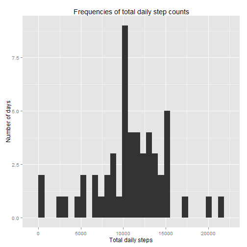
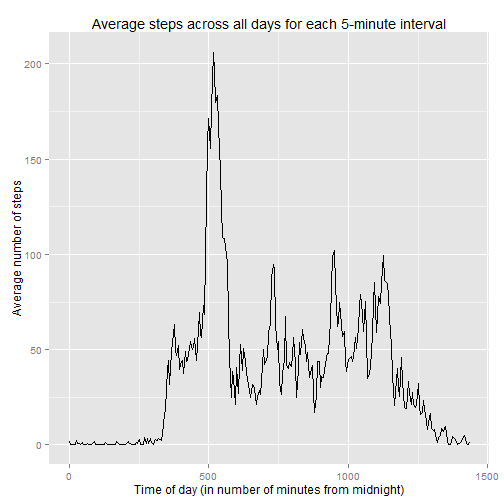
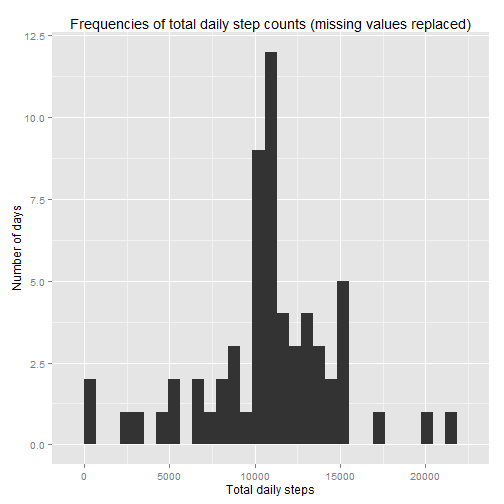
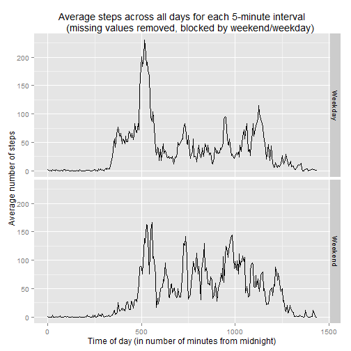

## Loading and preprocessing the data

1. We assume the user has forked
[the github repository](github.com/rdpeng/RepData_PeerAssessment1)
containing the data, and thus has it in their working directory.

We unzip the data, read it into a dataframe, and explore it.


```r
unzip("activity.zip")
act <- read.csv("activity.csv")
```

2. Since the dates are stored as a factor variable, not as dates, and we will
need to understand these dates as *dates* to determine whether they are weekdays
or weekends, we create a new column in the dataset, "day", storing the date in
date format.


```r
strDate <- as.character(act$date)
day <- ISOdate(substr(strDate,1,4),substr(strDate,6,7),substr(strDate,9,10))
act <- cbind(act,day)
```

Moreover, since the interval gives the 24-hour time of day, but is
encoded verbatim as an integer (ie. the time 15:35 is the integer 1535), and
this variable will be used for time-series analysis, we wish to convert it to
a more sensible representation of time, one without gaps (ie. between the 55min
intervals and the 00min intervals, eg. jumping from 55 to 100 or 1355 to 1400).


```r
strMin <- as.character(act$interval)
for(i in 1:length(strMin)){
    if(nchar(strMin[[i]])==1){strMin[[i]] <- paste0("000",strMin[[i]])}
    else if(nchar(strMin[[i]])==2){strMin[[i]] <- paste0("00",strMin[[i]])}
    else if(nchar(strMin[[i]])==3){strMin[[i]] <- paste0("0",strMin[[i]])}
}
minutes <- as.integer(substr(strMin,1,2))*60 + as.integer(substr(strMin,3,4),0)
act <- cbind(act,minutes)
```

We also note that there are missing values in the steps variable; these occur in
precisely eight 288-observation blocks (including two blocks that are adjacent),
each starting at interval 0 of a given day; the starting indices of these blocks
of NA values are: 1, 2017, 8929, 9793, 11233, 11521, 12673, 17281.

In other words, we are missing no data on any date except the following, and we
have no data for the entirety of each of the dates: 2012-10-01, 2012-10-08,
2012-11-01, 2012-11-04, 2012-11-09, 2012-11-10, 2012-11-14, 2012-11-30.

For convenience, we refer to these as *missing days*.

## What is the mean total number of steps taken per day?

1. We ignore missing values. Because we have observed that these fall on precisely
the "missing days" defined above, we know that any given day either contains
full, unbiased data, or no data at all.

We compute the total number of steps each day, and put the results of only the
non-missing days into a data frame.


```r
stepTotals <- tapply(act$steps,act$date,sum)
stepTotals <- data.frame(stepTotals[!is.na(stepTotals)])
```

2. We now plot a histogram of the daily totals.


```r
library(ggplot2)
qplot(stepTotals$stepTotals, data=stepTotals,
      xlab="Total daily steps", ylab="Number of days",
      main="Frequencies of total daily step counts")
```

 

3. Finally, we compute the mean and median of the total daily step counts,
respectively.


```r
mean(stepTotals$stepTotals)
```

```
## [1] 10766.19
```

```r
median(stepTotals$stepTotals)
```

```
## [1] 10765
```

## What is the average daily activity pattern?

1. We find the average across all days for each 5-minute interval, then plot the
time series of average steps vs. interval.


```r
intAve <- tapply(act$steps, act$minutes, mean,na.rm=TRUE)
intAveData <- data.frame(unique(act$minutes),intAve)
names(intAveData)[1] <- "minutes"

qplot(minutes, intAve, data=intAveData, geom="line",
      xlab="Time of day (in number of minutes from midnight)",
      ylab="Average number of steps",
      main="Average steps across all days for each 5-minute interval")
```

 

2. We determine the maximal average number of steps per 5-minute interval.


```r
max(intAve)
```

```
## [1] 206.1698
```

```r
which(intAve==max(intAve))
```

```
## 515 
## 104
```

That is, the maximum of 206.17 steps occurs during the 104th interval, ie.
from 08:35 to 08:40.

## Imputing missing values

1. We calculate the total number of missing values by recognising that the
booleans TRUE and FALSE evaluate numerically to 1 and 0, respectively:


```r
sum(is.na(act$steps))
```

```
## [1] 2304
```

2. To replace missing values, we replace a missing value in a
given interval with the mean number of steps across all days from that given
interval. This has the benefit of not altering the interval means (which is not
clearly better than another strategy such as replacement with median values,
but also not clearly worse).

3. We form a new dataset with the missing values replaced by means. Because of
our observation that missing values come in full "missing days", we know we can
simply paste in copies of our Average Steps vector to fill these missing values.


```r
fillData <- act
fillData$steps[is.na(act$steps)] <- intAve
```

4. We reproduce the work from the section *What is the mean total number of steps 
taken per day?*, part 3, but using the new data frame with missing values filled
in.


```r
fillTotals <- tapply(fillData$steps,fillData$date,sum)
qplot(fillTotals, xlab="Total daily steps", ylab="Number of days",
      main="Frequencies of total daily step counts (missing values replaced)")
```

 

```r
mean(fillTotals)
```

```
## [1] 10766.19
```

```r
median(fillTotals)
```

```
## [1] 10766.19
```

The mean and median of this new dataset with missing values filled in are both
10766.19; this is identical to the mean for the dataset with missing values (by
design), but the median has changed from 10765 to 10766.19. This is very small
difference, indeed, with percent change of:


```r
100*(10766.19-10765)/10765
```

```
## [1] 0.01105434
```

## Are there differences in activity patterns between weekdays and weekends?

1. We add a new column to our filled dataset, indicating whether the row's date
is either a weekday or a weekend.


```r
wkdays <- c("Monday","Tuesday","Wednesday","Thursday","Friday")
wkends <- c("Saturday","Sunday")
weektype <- weekdays(fillData$day)
for (i in 1:length(weektype)){
    if(weektype[i] %in% wkdays){
        weektype[i] <- "Weekday"
    } else{
        weektype[i] <- "Weekend"
    }
}
weektype <- factor(weektype,levels=c("Weekday","Weekend"))
fillData <- cbind(fillData,weektype)
```

2. We plot the mean number of steps taken per 5-minute interval, averaged over
all days, blocking by weekday and weekend.


```r
fillIntAve <-
    tapply(fillData$steps, list(fillData$minutes,fillData$weektype), mean)
fillIntAve <- data.frame(fillIntAve)
dayData <- data.frame(unique(fillData$minutes),fillIntAve$Weekday,
                      factor(rep("Weekday",length(fillIntAve$Weekday))))
names(dayData) <- c("Minutes", "Average","Weektype")
endData <- data.frame(unique(fillData$minutes),fillIntAve$Weekend,
                      factor(rep("Weekend",length(fillIntAve$Weekend))))
names(endData) <- c("Minutes", "Average","Weektype")
fillIntAveData <- rbind(dayData,endData)

qplot(Minutes, Average, data=fillIntAveData, facets= Weektype ~ ., geom="line",
      xlab="Time of day (in number of minutes from midnight)",
      ylab="Average number of steps",
      main="Average steps across all days for each 5-minute interval
      (missing values removed, blocked by weekend/weekday)")
```

 

Roughly speaking, it appears that weekdays are more lopsided, having a larger
spike of steps in the morning, about 500 to 600 minutes into the day (ie. around
9am), and relatively few thereafter. Weekdays also start earlier, with 
significant numbers of steps starting shortly after 300 minutes into the day
(ie. around 5am).

On the other hand, weekends still seem to have a lot of steps around 9am, but it
is relatively comparable to the number of steps throughout the day, until about 
1250 minutes, or about 9pm (though it is still jagged-there is just less
variation in the crests and troughs). Weekends tend to end about 100 minutes
later than weekdays.

